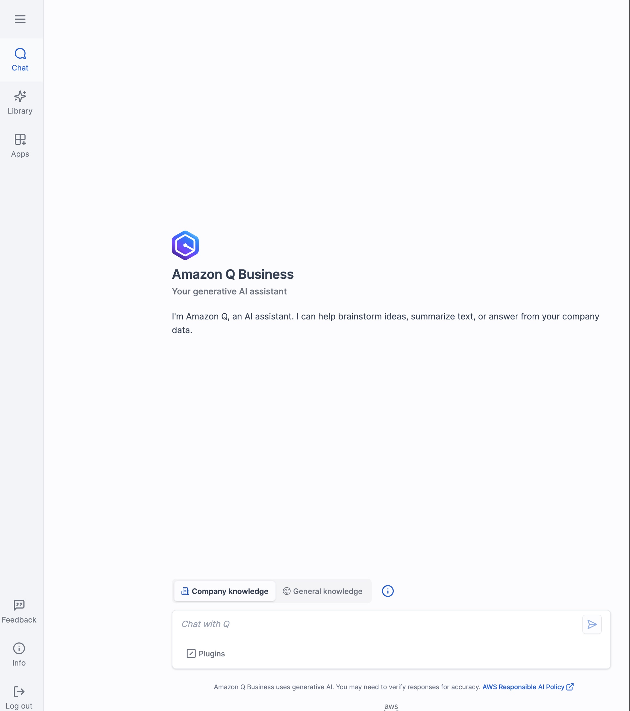

# Amazon Q Business - Agentic Connectors (Custom Plugin)

This project provides custom connector agents (plugins) for Amazon Q Business that enable secure connections with multiple external systems. These connectors handle authentication, data source setup, and data synchronization between Amazon Q Business and various enterprise systems.

## Table of Contents

- [Overview](#overview)
- [Connectors](#connectors)
- [Project Structure](#project-structure)
- [Prerequisites](#prerequisites)
- [Setup and Installation](#setup-and-installation)
- [Integration Flows](#integration-flows)
- [Security](#security)
- [Troubleshooting](#troubleshooting)
- [Code Standards](#code-standards)
- [Contributing](#contributing)
- [License](#license)
- [Appendix: SharePoint Connector Visual Flow](#appendix-sharepoint-connector-visual-flow)

## Overview

The Amazon Q Business Agentic Connectors project simplifies the integration between Amazon Q Business and various enterprise systems. These connectors automate the complex process of setting up secure connections, handling authentication, and managing data synchronization.

### Architecture Overview


### Key Components

1. **AWS Lambda Functions**
   - Authentication and Application Registration: Handles OAuth and certificate-based authentication
   - Data Source Operations: Sets up and manages data sources in Amazon Q Business
   - Synchronization Services: Handles data synchronization between external systems and Q Business

2. **AWS Services Used**
   - AWS Lambda: Executes serverless functions for connector operations
   - Amazon API Gateway: Provides RESTful API endpoints for the connectors
   - AWS IAM: Manages permissions and security
   - Amazon S3: Stores certificates and configuration data
   - DynamoDB: Manages state for OAuth flows
   - Amazon Q Business Plugin Framework: Integrates with Q Business services

## Connectors

### 1. SharePoint Connector

Enables secure connections with Microsoft SharePoint through certificate-based authentication.

Key features:
- Automated certificate generation and management
- Streamlined Microsoft Entra ID application setup
- Simplified SharePoint data source configuration
- Secure authentication using certificate-based authentication

### 2. Zendesk Connector

Enables secure connections with Zendesk through OAuth 2.0 authentication.

Key features:
- OAuth 2.0 application setup and configuration
- Secure token management
- Zendesk data source configuration

### 3. ServiceNow Connector

Enables secure connections with ServiceNow through OAuth authentication.

Key features:
- OAuth application setup and configuration
- ServiceNow data source configuration

### 4. Salesforce Connector

Enables secure connections with Salesforce through Connected App and username/password authentication.

Key features:
- Automated Connected App creation via Salesforce APIs
- Session-based authentication using SOAP/REST APIs
- Comprehensive Salesforce object support (Knowledge Articles, Cases, Opportunities, Accounts, Contacts, Chatter)
- Secure credential storage in AWS Secrets Manager
- Configurable sync options and attachment crawling

### 5. Salesforce Actions Plugin

Enables interactive actions with Salesforce directly from Amazon Q Business.

Key features:
- Automated Connected App creation for Actions integration
- OAuth 2.0 authentication with comprehensive scopes
- Pre-configured plugin service role with proper trust policy
- Enables creating, updating, and viewing Salesforce records from Q Business
- Supports executing Salesforce workflows and searching Salesforce data

### 6. Q Business Operations

Provides common operations for managing Amazon Q Business resources across all connectors.

Key features:
- List Q Business applications and their configurations
- Manage data source synchronization
- Analyze synchronization logs and performance
- Centralized error handling and troubleshooting

## Project Structure

```
q-business-agentic-connectors/
├── plugin/                          # Plugin implementation
│   ├── lambdas/                     # Lambda functions for connector operations
│   │   ├── sharepoint/              # SharePoint connector functions
│   │   │   ├── create-certificate/  # Certificate generation
│   │   │   ├── create-azure-app/    # Azure app creation
│   │   │   ├── create-data-source/  # SharePoint data source creation
│   │   │   └── helper/              # SharePoint helper functions
│   │   ├── zendesk/                 # Zendesk connector functions
│   │   │   ├── create-zendesk-oauth-app/  # OAuth app creation
│   │   │   ├── create-data-source/  # Zendesk data source creation
│   │   │   ├── oauth-callback/      # OAuth callback handling
│   │   │   └── zendesk-oauth-app-helper/ # Zendesk helper functions
│   │   ├── servicenow/              # ServiceNow connector functions
│   │   │   ├── create-oauth-app/    # OAuth app creation
│   │   │   ├── create-data-source/  # ServiceNow data source creation
│   │   │   └── helper/              # ServiceNow helper functions
│   │   ├── salesforce/              # Salesforce connector functions
│   │   │   ├── create-connected-app/     # Connected App creation
│   │   │   ├── test-authentication/      # Authentication testing
│   │   │   ├── create-data-source/       # Salesforce data source creation
│   │   │   ├── update-credentials/       # Update stored credentials
│   │   │   ├── create-salesforce-actions-connected-app/  # Actions Connected App creation
│   │   │   ├── setup-salesforce-actions-plugin/          # Actions Plugin setup
│   │   │   └── helper/                   # Salesforce helper functions
│   │   ├── operations/              # Common operations across all connectors
│   │   │   ├── qbusiness-list-applications/  # List Q Business applications
│   │   │   ├── qbusiness-sync-data-source/   # Sync data sources
│   │   │   ├── qbusiness-sync-summary/       # Get sync history
│   │   │   └── qbusiness-cloudwatch-logs/    # Analyze CloudWatch logs
│   │   └── common/                  # Shared code and utilities
│   └── openApi/                     # OpenAPI specifications for the connectors
│       ├── sharepoint_spec.yaml     # SharePoint connector API definition
│       ├── zendesk_spec.yaml        # Zendesk connector API definition
│       ├── servicenow_spec.yaml     # ServiceNow connector API definition
│       ├── salesforce_spec.yaml     # Salesforce connector API definition
│       └── qbusiness_spec.yaml      # Q Business operations API definition
└── connector-plugin-infra-setup/    # Infrastructure as Code (CDK)
    ├── lib/                         # CDK stack definitions
    │   ├── sharepoint/              # SharePoint connector infrastructure
    │   ├── zendesk/                 # Zendesk connector infrastructure
    │   ├── servicenow/              # ServiceNow connector infrastructure
    │   ├── salesforce/              # Salesforce connector infrastructure
    │   ├── qbusinessOps/            # Q Business operations infrastructure
    │   ├── authorizer/              # API authorization components
    │   ├── common/                  # Shared infrastructure components
    │   └── templates/               # Template files for infrastructure
    ├── bin/                         # CDK app entry point
    └── cdk.json                     # CDK configuration
```

## Prerequisites

Before you begin, ensure you have the following:

- **Amazon Q Business Application and Index**
  - You must have already created an Amazon Q Business application
  - You must have already created an index within your Q Business application
  - Note the application ID and index ID as they will be required for the integration

- **AWS Account** with appropriate permissions to:
  - Create and manage Lambda functions
  - Create and manage API Gateway resources
  - Create and manage IAM roles and policies
  - Create and manage S3 buckets and DynamoDB tables

- **External System Credentials**:
  - **For SharePoint**: Microsoft Entra Administrator access and SharePoint Online subscription
  - **For Zendesk**: Zendesk administrator access
  - **For ServiceNow**: ServiceNow administrator access

- **Development Environment**:
  - Node.js 18.x or later
  - Python 3.10 or later
  - AWS CDK CLI (`npm install -g aws-cdk`)
  - AWS CLI configured with appropriate credentials

## Setup and Installation

### 1. Local Development Setup

```bash
# Clone the repository
git clone <repository-url>
cd q-business-agentic-connectors

# Install dependencies for the infrastructure setup
cd connector-plugin-infra-setup
npm install
```

### 2. Configure AWS Credentials

Ensure your AWS credentials are properly configured:

```bash
aws configure
```

### 3. Infrastructure Deployment

```bash
# Build the TypeScript code
npm run build

# Synthesize the CloudFormation template to verify
cdk synth

# Deploy a specific connector stack (e.g., SharePoint)
cdk deploy SharepointStack --parameters QBusinessPluginApplicationId=<your-application-id>

# Or deploy the Zendesk connector
cdk deploy ZendeskStack --parameters QBusinessPluginApplicationId=<your-application-id>

# Or deploy the ServiceNow connector
cdk deploy ServiceNowStack --parameters QBusinessPluginApplicationId=<your-application-id>

# Or deploy the Salesforce connector
cdk deploy SalesforceStack --parameters QBusinessPluginApplicationId=<your-application-id>

# Or deploy the Q Business Operations stack
cdk deploy QBusinessOperationsStack --parameters QBusinessPluginApplicationId=<your-application-id>
```

### 4. Post-Deployment Configuration

After deployment, you'll need to:

1. Verify the CDK outputs for API Gateway URLs and other resources
2. Configure the external systems with the appropriate credentials and callback URLs
3. Verify the plugins in the Amazon Q Business console

## Integration Flows

### SharePoint Integration Flow

1. **Azure Application Registration**
   - Register a new application in Microsoft Entra ID
   - Configure the application with necessary SharePoint permissions
   
2. **Certificate Generation**
   - Generate a self-signed certificate for secure communication
   - Store the certificate in an S3 bucket
   
3. **Certificate Upload to Azure**
   - Upload the certificate to the Azure application
   - Establish trust between AWS and Microsoft services
   
4. **Data Source Creation**
   - Create a new SharePoint data source in Amazon Q Business
   - Configure the data source with Azure application details and certificate information

### Zendesk Integration Flow

1. **OAuth Application Setup**
   - Create a new OAuth application in Zendesk
   - Configure redirect URLs and permissions
   
2. **OAuth Authentication**
   - Perform OAuth 2.0 authentication flow
   - Securely store access and refresh tokens
   
3. **Data Source Creation**
   - Create a new Zendesk data source in Amazon Q Business
   - Configure the data source with OAuth credentials

### ServiceNow Integration Flow

1. **OAuth Application Setup**
   - Create a new OAuth application in ServiceNow
   - Configure redirect URLs and permissions
   
2. **Data Source Creation**
   - Create a new ServiceNow data source in Amazon Q Business
   - Configure the data source with OAuth credentials

### Salesforce Integration Flow

1. **Connected App Creation**
   - Provide Salesforce credentials (username, password, security token, instance URL)
   - Automatically create a Connected App via Salesforce APIs
   - Store all credentials securely in AWS Secrets Manager
   
2. **Authentication Testing**
   - Test the complete authentication chain using stored credentials
   - Validate OAuth 2.0 Username-Password flow
   - Confirm API access and user permissions
   
3. **Data Source Creation**
   - Create a new Salesforce data source in Amazon Q Business
   - Configure included objects (Knowledge Articles, Cases, Opportunities, etc.)
   - Set up synchronization schedule and options

### Salesforce Actions Plugin Flow

1. **Actions Connected App Creation**
   - Provide Salesforce credentials (username, password, security token, instance URL)
   - Automatically create a Connected App specifically for Actions with comprehensive OAuth scopes
   - Configure proper redirect URLs for OAuth authentication
   
2. **Plugin Setup**
   - Store OAuth credentials securely in AWS Secrets Manager
   - Create the Salesforce Actions Plugin in Amazon Q Business
   - Configure the plugin with the pre-created service role
   
3. **User Authentication**
   - End users authenticate with Salesforce via OAuth
   - Q Business securely manages tokens for ongoing interactions
   
4. **Performing Actions**
   - Users can create, update, and view Salesforce records
   - Execute Salesforce workflows and search Salesforce data
   - All actions respect user permissions in Salesforce

### Common Operations (Q Business Operations)

After setting up any of the above connectors, you can use these common operations for managing and monitoring your data sources:

1. **List Applications**
   - Retrieve all Q Business applications and their associated indices
   - Used to select the target application and index for data source creation

2. **Sync Data Source**
   - Trigger a synchronization job for any data source
   - Common endpoint used by all connectors

3. **Sync Summary**
   - Retrieve synchronization history and metrics for any data source
   - View success/failure status, document counts, and timing information

4. **CloudWatch Logs Analysis**
   - Analyze CloudWatch logs for synchronization errors
   - Identify specific documents that failed to index and error reasons

These common operations provide a unified interface for managing data sources across all connector types.

## Security

**This project is intended for demonstration and development purposes only.** Organizations planning to use this in production must conduct their own security review and implement additional security measures such as VPC deployment, customer-managed KMS keys, enhanced monitoring, and compliance controls appropriate for their environment.

Security features included in this demo:

- **Authentication**: Secure authentication using OAuth 2.0 or certificate-based authentication
- **Credential Storage**: Secure storage of credentials using AWS Secrets Manager
- **Access Control**: Fine-grained access control using IAM roles and policies
- **Data Protection**: Encryption of data in transit and at rest
- **Audit Logging**: Comprehensive logging of all operations

## Troubleshooting

### Common Issues and Solutions

1. **Authentication Failures**
   - Verify credentials and permissions in the external systems
   - Check for correct configuration of OAuth applications or certificates

2. **Data Source Creation Failures**
   - Ensure the Q Business application and index exist
   - Verify the external system URLs are accessible and correctly formatted
   - Check that all required permissions are granted

3. **Synchronization Issues**
   - Verify the data source is properly configured
   - Check permissions in the external systems
   - Review Q Business logs for specific error messages
   - Use the common operations for log analysis to diagnose synchronization errors

### Logging and Monitoring

- All Lambda functions log to CloudWatch Logs
- API Gateway access logs can be enabled for request tracking
- Use X-Ray for tracing requests through the system
- The common operations provide detailed error analysis and performance metrics

## Code Standards

This project follows strict coding standards to ensure code quality, readability, and maintainability. We use various linting and formatting tools to enforce these standards:

- **Python**: Black, isort, flake8, and pylint
- **TypeScript**: ESLint and Prettier

For detailed information about our coding standards, linting rules, and how to run the linting tools, please refer to the [CODE_STANDARDS.md](CODE_STANDARDS.md) document.

### Automatic Linting

A pre-commit hook is set up to automatically run linting tools on staged Python files before committing. This ensures that all committed code meets our standards.

### Linting Script

A script is provided to automatically fix common linting issues:

```bash
python lint_fix.py
```

## Contributing
See [CONTRIBUTING](./CONTRIBUTING.md) for more information.

## License
This library is licensed under the MIT-0 License. See the [LICENSE](./LICENSE) file. 

## Appendix: SharePoint Connector Visual Flow

The SharePoint connector provides a streamlined process for connecting Amazon Q Business to your SharePoint sites. Below is a visual guide to the connector flow:

1. **Login to Amazon Q Business Plugin**

   

2. **Attach the SharePoint Plugin**

   

3. **Generate Certificate**

   
   
   Certificate generation complete:
   
   

4. **Create Azure Application**

   
   
   Azure application creation complete:
   
   

5. **Upload Certificate to Azure**

   Certificate upload complete:
   
   

6. **Grant Permissions in Microsoft Entra ID**

   

7. **Create SharePoint Data Source**

   
   
   Data source creation complete:
   
   

8. **Initiate Data Synchronization**

   

9. **Monitor Synchronization Progress**

   
   
   Final synchronization status:
   
   

10. **Troubleshooting (if needed)**

    View CloudWatch logs for error details:
    
    
